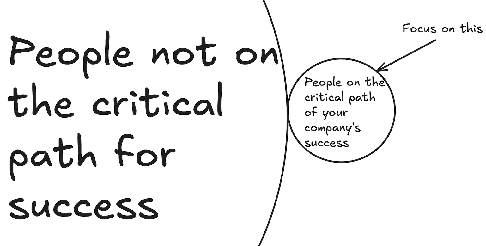

Building a company is an exercise in empirically testing your belief systems. Everything your company does is essentially testing a hypothesis. Your successful product was once a hypothesis that was proven correct. Your failed pivots were hypotheses that were proven wrong. This is how the game works. If you're right, you win. If you're wrong, you lose. It's that simple. And the more right you are about the "important" things, the bigger the upside.

Take a contentious example: working "hardcore" hours. If you genuinely believe that working 14 hour days and weekends and frequently sleeping in the office is the optimal way to build your business, then run your company that way, demand it from your employees and vendors, and let the free market decide. 

I'm 100% serious.

If you're right, your team's work ethic will make the difference in the market. You'll make the better product, get more customers, close more deals, and your company will do great. If you're wrong, no one will want to work for you, employees will churn, your product will fall over, and your business will die. Fun!

I'm not saying this to suggest that you go around implementing controversial policies or hardcore policies for the sake of it. If you think a 4 hour work week is your path to success, then it doesn't matter what I think; go do that! The market will tell you whether you're right or wrong. 

That's the beauty of this mental model: the only thing that matters about your hypotheses (aka how your company works) is whether they're right or wrong, _not_ their overall popularity.

Put differently: it does not matter how many people disagree with you or criticize your company for demanding 14 hour days or 4 hour weeks from your employees. What matters is how many people agree. If you have the right customers and employees, then who cares what I or others think? If it works for you, it works for you. So don't seek consensus about how your company should run from people not on the critical path of its success (i.e anoyne who isn't a customer, partner, employee, or shareholder). As long as you can get the needed critical mass of people who want to work at your company and enough customers to use your product, your company will succeed, because your hypothesis was correct. 

Companies often get this wrong in a few ways: 

1. Ineffectively proliferating their culture
2. Not being very clear with prospective hires about values & operating principles
3. Trying to be everything for everyone, especially when values change after the company's founding

The least obvious but in my opinion most important way that companies get this wrong is by having ineffective values. To explain this, it's useful to understand the difference between **culture** and **values**. Ben Horowitz [explains culture pretty well](https://a16z.com/books/what-you-do-is-who-you-are/): 

> Culture is basically: how does your company behave when you're not looking? Do they show up to meetings on time? If somebody calls them, do they return the call? If it's someone lower rank than them, do they return it? Do they return it after a day? The next day? The next week? If they do a deal, is it for the price, or the partnership? What are they optimizing for? All those things are not in your goals and objectives, not in your mission statement, and not in your OKRs. It's how people behave on a daily basis. 
> 
> **A culture is not a set of beliefs, it's a set of actions.** 

**Values**, on the other hand, are what you tell the world (employees, newhires, customers, etc..) about your culture. It's what you put up on the wall in the office or in your culture deck, things like "We take ownership of our work" or "we're a sports team, not a family". 

In that sense, what most people think of as their company culture is actually their values. But here's the thing: a value is just an idea. By itself, it has no impact. The only impact lies in whether people actually abide by it. 

This is where most companies stumble: they write up their values in a culture deck, hang them on the office wall, announce it in a roo-rah all-hands meeting, then expect them to automatically proliferate throughout the company. Unfortunately, this is not how it works. Because culture is a set of actions and not a set of beliefs, it must be reinforced constantly. Ideally, every time someone does something in line with the desired culture, their behavior should be reinforced, if even with a "thank you" or "nice work!". Those of us who have lived in the real world, of course, realize that this is idealistic; not every positive display of culture will be seen, let alone acknowledged. At the very least, culture should be regularly reinforced in the most important venues: performance reviews, raises, promotion decisions, and public venues like Slack or all-hands commendments. But more crucially, behaviors that run counter to the desired culture should be immediately corrected. If someone takes credit for someone else's work, even if in a small or nonconclusive way, it should be made clear that this is not okay. If someone half-or-80%-asses a task or assignment, it may be easier to let it go in the moment and touch up their work, but if you do that, you're also indirectly telling everyone who's watching that it's okay to keep doing this, and that their standing within the company will not be impacted. So it's crucial in those situations, to quickly correct the action and reset expectations. 

For this reason, effectively proliferating a desired culture can be _freaking hard_. Every interaction within a company is potentially a test of whether you actually have the culture your values claim you do, and whether you're willing to make the effort to correct it. Of course, anyone who built a team will tell you that if you're spending all your time fixing culture, then your error was actually in hiring those people who don't _already_ adhere to your values. 

There's a lot of truth to this, and it's a great segue into the second failure mode companies run into with regards to culture: not being extremely and unapologetically clear with potential hires about your actual culture (not the one you say you have, or the one you wish you had). 

Picture this: you & your coworkers normally work 10-12 hours a day and sometimes on weekends (not that uncommon at startups). You're interviewing someone who you really like, and they ask some version of "how many hours are people at your company expected to work?". You _really_ want this person to join because they're super talented and would help you push the business forward and relieve pressure on you or your team. So in the moment, you say what you think they want to hear: "It's not that bad, work hours are pretty reasonable and people only work on the weekends very occasionally and mostly because they're excited about the work, but it's definitely not an expectation". If the candidate joins with the expectation they'll work a 9-5 when your company isn't actually that, you've just shot yourself in the foot, because this person isn't actually a fit for your team. Either you'll begrudgingly water down what you believe deep in your heart to be true (everyone should grind) which will lead to resentment or a dysfunctional team, or you'll have wasted a ton of time hiring & onboarding someone who will leave the company when one of you realizes it's not a good fit.  It's a classic case of how being short-term nice to someone can actually be long-term mean or dishonest to them and yourself. 

I've seen this a lot when companies are looking to hit aggressive headcount growth or trying to do things like hire more diversely. To be clear, I'm not saying diverse hiring isn't worthwhile, but that if you have to knowingly misrepresent or tell a "white lie" about your company's culture to hit your goals, then you should either change your culture or your goals. Anything short of a genuine, real effort to do either of those things will bite you. 

The other way companies screw this up is by trying to be everything to everyone, especially when the company values or culture changes after the fact. This typically happens when the founders try to aggressively minimize employee unhappiness at the direct cost of the company's success. For example, when in 2020, Coinbase felt that political polarization within the company was hindering their ability to move forward as a business, Brian Armstrong [banned all political talk within the company that is not directly related to the company's mission](https://www.coinbase.com/blog/coinbase-is-a-mission-focused-company). He got a ton of stick for it at the time. But had he not stayed true to what they genuinely believed, his ability to run the business as they perceived it would have been diminished, and they would have likely been less effective operators of the business, if only because they're spending many brain cycles getting frustrated at what they perceive to be a huge inefficiency in their company. The people who disagreed with this decision left the company, which I'm sure sucked for everyone involved in the short-term. But long-term, I believe Coinbase is now a more cohesive and effective business for it, because its people are spending less time fighting about things unrelated to their direct goals, and more time doing things that help them achieve them. 

At the end of the day, what matters in your capacity as a founder or leader is guaranteeing your company's success. People - often many of whom you geniunely deeply care about - might disagree or get frustrated or even not work with you altogether, and that really _really_ sucks for everyone involved. 

But only in the short-term. 

In the long-term, it's in everyone's best interest to find the equilibrium that works both for them individually and for the business. It requires discipline to implement and may be painful to do. But in my experience it's the best way to long-term minimize pain and maximize prosperity. Every other solution I've seen may be short-term easy, but unfortunately, leads to suboptimal outcomes. 

